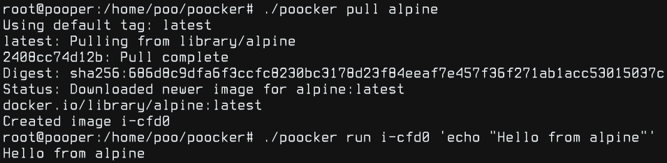

# Poocker

Poocker stands for **Poor's man Docker**, but can also be interpreted as a
*shittier* version of it



### Features:
 - It may create images and run containers
 - 69% chance of breaking your system
 - Blatant copy of [Bocker](https://github.com/p8952/bocker)
 - Inspired by [Build your own X](https://github.com/codecrafters-io/build-your-own-x)

### Resources:

If you're trying to learn a little more about images, containers, linux
namespaces and btrfs subvolumes this is a cool project. Here's a list of cool
guides and references I used to learn and develop this:

 - [Bocker - p8952](https://github.com/p8952/bocker)
 - [Understanding the Podman internals - Cloud Native Islamabad](https://youtu.be/kJnxeinEWyA)
 - [unshare - manpages](https://www.man7.org/linux/man-pages/man1/unshare.1.html)

### Setup:

**Requirements**:

 1. Get a VM and install BTRFS system in it
```sh
quickget ubuntu focal
quickemu --vm ubuntu-focal.conf --display none
```
 2. Install [Docker](https://docs.docker.com/engine/install/ubuntu) and
	[Undocker](https://pypi.org/project/undocker) (feels like cheating and it is
	but only used for pulling images, didn't want to deal with docker registry auth)
 3. Clone this repo
 4. Pull image
```sh
./poocker pull alpine
```
 5. Run container
```sh
./poocker run "$IMAGE_ID" 'echo Hello from Alpine'
```
 6. List images and containers
```sh
./poocker ls
```
